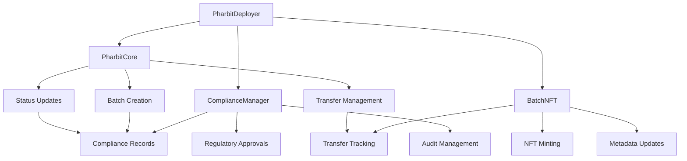
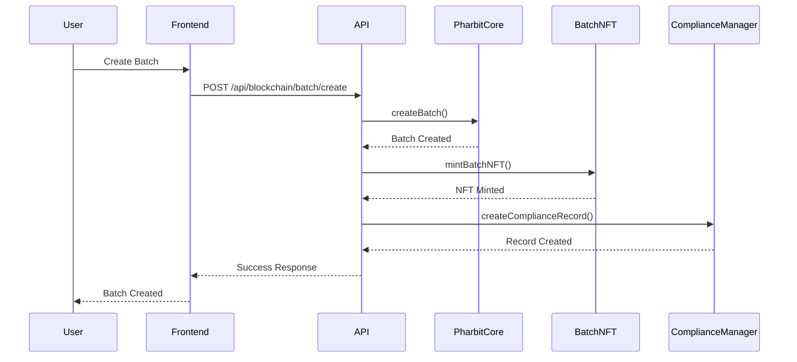
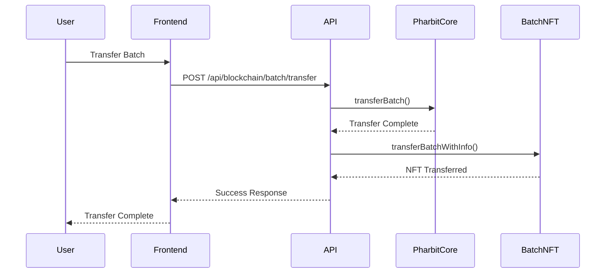

# PharbitChain Architecture Documentation

## 🏗️ System Architecture Overview

PharbitChain is built as a multi-layered EVM-compatible pharmaceutical blockchain system that ensures compliance, security, and scalability for pharmaceutical supply chain management.

## 📐 High-Level Architecture

```
┌─────────────────────────────────────────────────────────────────┐
│                        User Interface Layer                     │
├─────────────────────────────────────────────────────────────────┤
│  React Frontend  │  MetaMask  │  Mobile App  │  Admin Dashboard │
├─────────────────────────────────────────────────────────────────┤
│                        API Gateway Layer                        │
├─────────────────────────────────────────────────────────────────┤
│  Express.js  │  Authentication  │  Rate Limiting  │  CORS        │
├─────────────────────────────────────────────────────────────────┤
│                      Business Logic Layer                       │
├─────────────────────────────────────────────────────────────────┤
│  Blockchain Service  │  Compliance Service  │  Document Service │
├─────────────────────────────────────────────────────────────────┤
│                      Smart Contract Layer                       │
├─────────────────────────────────────────────────────────────────┤
│  PharbitCore  │  ComplianceManager  │  BatchNFT  │  PharbitDeployer│
├─────────────────────────────────────────────────────────────────┤
│                      Blockchain Layer                           │
├─────────────────────────────────────────────────────────────────┤
│  Ethereum  │  Polygon  │  BSC  │  Arbitrum  │  Other EVM Chains │
├─────────────────────────────────────────────────────────────────┤
│                      Data Storage Layer                         │
├─────────────────────────────────────────────────────────────────┤
│  Supabase  │  AWS S3  │  Redis  │  LevelDB  │  PostgreSQL      │
└─────────────────────────────────────────────────────────────────┘
```

## 🔧 Smart Contract Architecture

### Contract Hierarchy

```
PharbitDeployer (Factory)
├── PharbitCore (Main Logic)
│   ├── Batch Management
│   ├── Transfer Tracking
│   ├── Status Updates
│   └── Emergency Controls
├── ComplianceManager (Regulatory)
│   ├── Compliance Records
│   ├── Regulatory Approvals
│   ├── Audit Trails
│   └── Standards Management
└── BatchNFT (Tokenization)
    ├── ERC721 Implementation
    ├── Metadata Management
    ├── Transfer History
    └── Custom Attributes
```

### Contract Interactions



## 🎯 Core Components

### 1. PharbitCore Contract

**Purpose**: Main contract for pharmaceutical operations

**Key Features**:
- Batch lifecycle management
- Transfer tracking with compliance
- Role-based access control
- Emergency pause functionality
- Status transition validation

**State Variables**:
```solidity
mapping(uint256 => DrugBatch) public batches;
mapping(uint256 => TransferRecord[]) public batchTransfers;
mapping(string => uint256) public batchNumberToId;
mapping(address => uint256[]) public userBatches;
```

**Key Functions**:
- `createBatch()`: Create new pharmaceutical batch
- `transferBatch()`: Transfer batch ownership
- `updateBatchStatus()`: Update batch status
- `emergencyPause()`: Emergency stop functionality

### 2. ComplianceManager Contract

**Purpose**: FDA compliance and regulatory features

**Key Features**:
- Compliance record management
- Regulatory approval tracking
- Audit trail management
- Compliance standards
- Inspector role management

**State Variables**:
```solidity
mapping(uint256 => ComplianceRecord) public complianceRecords;
mapping(uint256 => RegulatoryApproval) public regulatoryApprovals;
mapping(uint256 => AuditTrail) public auditTrails;
mapping(string => ComplianceStandard) public complianceStandards;
```

**Key Functions**:
- `createComplianceRecord()`: Create compliance record
- `grantRegulatoryApproval()`: Grant drug approval
- `conductAudit()`: Conduct compliance audit
- `addComplianceStandard()`: Add compliance standard

### 3. BatchNFT Contract

**Purpose**: NFT implementation for batch tokenization

**Key Features**:
- ERC721 standard compliance
- Metadata management
- Transfer history tracking
- Custom attributes
- Compliance certificates

**State Variables**:
```solidity
mapping(uint256 => BatchMetadata) public batchMetadata;
mapping(uint256 => TransferHistory[]) public transferHistory;
mapping(string => uint256) public batchNumberToTokenId;
mapping(address => uint256[]) public userTokens;
```

**Key Functions**:
- `mintBatchNFT()`: Mint NFT for batch
- `updateBatchMetadata()`: Update batch metadata
- `transferBatchWithInfo()`: Transfer with additional info
- `burnBatchNFT()`: Burn NFT (recall)

### 4. PharbitDeployer Contract

**Purpose**: Factory contract for deployment

**Key Features**:
- One-click deployment
- Role setup and initialization
- Address management
- Configuration management

**State Variables**:
```solidity
mapping(address => DeploymentInfo) public deployments;
mapping(address => ContractAddresses) public contractAddresses;
address[] public allDeployments;
```

**Key Functions**:
- `deployContracts()`: Deploy all contracts
- `deployContractsWithRoles()`: Deploy with custom roles
- `getDeploymentInfo()`: Get deployment information
- `updateDeploymentConfiguration()`: Update configuration

## 🔐 Security Architecture

### Access Control Matrix

| Role | PharbitCore | ComplianceManager | BatchNFT | PharbitDeployer |
|------|-------------|-------------------|----------|-----------------|
| Admin | Full Access | Full Access | Full Access | Full Access |
| Manufacturer | Create/Transfer Batches | - | Mint/Update NFTs | - |
| Distributor | Transfer Batches | - | - | - |
| Pharmacy | Transfer/Dispense Batches | - | - | - |
| Inspector | Update Status | Create/Update Records | Update Metadata | - |
| FDA | Emergency Controls | Grant Approvals | - | - |
| Deployer | - | - | - | Deploy Contracts |

### Security Measures

1. **Role-Based Access Control (RBAC)**
   - OpenZeppelin AccessControl
   - Granular permissions
   - Role hierarchy

2. **Input Validation**
   - Parameter validation
   - Range checks
   - Type validation

3. **Reentrancy Protection**
   - ReentrancyGuard modifier
   - State updates before external calls

4. **Emergency Controls**
   - Pausable functionality
   - Emergency stop
   - Circuit breakers

5. **Gas Optimization**
   - Efficient storage patterns
   - Batch operations
   - Minimal external calls

## 📊 Data Flow Architecture

### Batch Creation Flow



### Transfer Flow



## 🗄️ Data Storage Architecture

### Multi-Layer Storage Strategy

1. **Blockchain Storage**
   - Immutable transaction records
   - Smart contract state
   - Event logs

2. **Supabase (PostgreSQL)**
   - User data
   - Application state
   - Real-time subscriptions

3. **AWS S3**
   - Document storage
   - Compliance certificates
   - Audit files

4. **Redis**
   - Session management
   - Caching
   - Real-time data

5. **LevelDB**
   - Local blockchain data
   - Offline storage
   - Backup data

## 🔄 Integration Architecture

### External Integrations

1. **MetaMask Integration**
   - Wallet connection
   - Transaction signing
   - Network switching

2. **AWS S3 Integration**
   - Document upload/download
   - Compliance file storage
   - Backup management

3. **Supabase Integration**
   - Real-time subscriptions
   - User management
   - Data synchronization

4. **Blockchain Network Integration**
   - Multi-chain support
   - Network switching
   - Gas optimization

## 📈 Scalability Architecture

### Horizontal Scaling

1. **API Layer Scaling**
   - Load balancing
   - Auto-scaling
   - CDN integration

2. **Database Scaling**
   - Read replicas
   - Sharding
   - Connection pooling

3. **Blockchain Scaling**
   - Layer 2 solutions
   - Sidechains
   - State channels

### Performance Optimization

1. **Frontend Optimization**
   - Code splitting
   - Lazy loading
   - Caching strategies

2. **Backend Optimization**
   - Database indexing
   - Query optimization
   - Caching layers

3. **Smart Contract Optimization**
   - Gas optimization
   - Batch operations
   - Efficient algorithms

## 🔍 Monitoring Architecture

### Monitoring Layers

1. **Application Monitoring**
   - Performance metrics
   - Error tracking
   - User analytics

2. **Infrastructure Monitoring**
   - Server metrics
   - Database performance
   - Network monitoring

3. **Blockchain Monitoring**
   - Transaction monitoring
   - Gas usage tracking
   - Contract events

4. **Compliance Monitoring**
   - Audit trail tracking
   - Compliance status
   - Regulatory reporting

## 🚀 Deployment Architecture

### Deployment Environments

1. **Development**
   - Local blockchain
   - Mock services
   - Hot reloading

2. **Staging**
   - Testnet deployment
   - Production-like setup
   - Integration testing

3. **Production**
   - Mainnet deployment
   - High availability
   - Monitoring and alerting

### Deployment Strategy

1. **Smart Contracts**
   - Hardhat deployment
   - Contract verification
   - Address management

2. **Backend Services**
   - Docker containers
   - Kubernetes orchestration
   - Auto-scaling

3. **Frontend Application**
   - Static hosting
   - CDN distribution
   - Environment configuration

## 🔧 Configuration Management

### Environment Configuration

1. **Development**
   - Local configuration
   - Debug settings
   - Mock services

2. **Staging**
   - Testnet configuration
   - Staging services
   - Limited access

3. **Production**
   - Mainnet configuration
   - Production services
   - Security settings

### Configuration Sources

1. **Environment Variables**
   - Sensitive data
   - Environment-specific settings
   - Runtime configuration

2. **Configuration Files**
   - Application settings
   - Feature flags
   - Default values

3. **External Services**
   - Secret management
   - Configuration services
   - Dynamic configuration

## 📋 Compliance Architecture

### Regulatory Compliance

1. **FDA 21 CFR Part 11**
   - Digital signatures
   - Audit trails
   - Data integrity
   - Access controls

2. **GDPR Compliance**
   - Data protection
   - Privacy controls
   - Right to erasure
   - Data portability

3. **SOX Compliance**
   - Financial controls
   - Audit requirements
   - Documentation
   - Risk management

### Compliance Features

1. **Audit Trails**
   - Complete transaction history
   - User activity tracking
   - Change management
   - Immutable records

2. **Data Integrity**
   - Cryptographic hashing
   - Digital signatures
   - Checksum validation
   - Version control

3. **Access Controls**
   - Role-based permissions
   - Multi-factor authentication
   - Session management
   - Audit logging

## 🔮 Future Architecture Considerations

### Planned Enhancements

1. **Layer 2 Integration**
   - Polygon support
   - Arbitrum integration
   - Optimism deployment

2. **Cross-Chain Support**
   - Bridge contracts
   - Multi-chain deployment
   - Interoperability

3. **Advanced Features**
   - Machine learning integration
   - IoT device integration
   - Advanced analytics
   - AI-powered compliance

4. **Performance Improvements**
   - State channels
   - Sidechains
   - Sharding
   - Optimistic rollups

This architecture provides a solid foundation for a production-ready pharmaceutical blockchain system that can scale, maintain security, and ensure compliance with regulatory requirements.